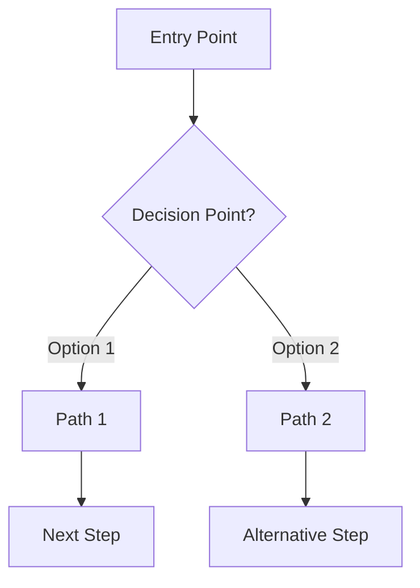

# Development Plan Generator Prompt

Use this prompt at the beginning of a new project to generate a structured development plan with MVP focus, TDD and Git workflow integration.

```
As a technical software architect specializing in TDD and Agile/MVP methodologies, create a comprehensive development plan for a new project with the following specifications:

Project name: [PROJECT_NAME]
Project type: [PROJECT_TYPE e.g., web app, mobile app, API]
Core technologies: [TECHNOLOGIES e.g., React, TypeScript, Zustand]
Key features:
- [FEATURE_1]
- [FEATURE_2]
- [FEATURE_3]
...

Please structure the development plan following an MVP-first, feature-slice approach with these elements:

1. Use categorical task identifiers that reflect user-facing features or core functionality
2. Group tasks by functional phases that deliver complete vertical slices of functionality
3. Prioritize features based on user value, starting with the absolute minimum functionality needed
4. Git workflow integration including:
   - Branch naming convention reflecting MVP phases (mvp/, feat/, enhance/, etc.)
   - Commit message formats following conventional commits (without predefined messages in the plan)
   - Pull request checkpoints with clear identifiers
   - Version tagging strategy with incremental usable releases

5. TDD approach with explicit test-writing steps before implementation
6. Clearly marked milestones with version tags for each functional increment
7. Checkbox format for progress tracking ([  ])

Structure the implementation phases to deliver complete user functionality:

0. Epic Definition & Roadmapping
   - Define user stories in "As a user, I want to..., So that..." format
   - Create user flow diagrams using Mermaid.js syntax
   - Define MVP scope and feature prioritization
   - Identify technical constraints and requirements

1. MVP Foundation & Core Functionality
   - Minimal data model with only essential entities and attributes
   - Core business logic and essential operations
   - Minimal UI components that enable basic user flows
   - Initial integration between components
   - Focus on delivering a functional, though limited, user experience

2. Essential Enhancements
   - Secondary user flows and operations
   - Basic data persistence
   - Essential user feedback mechanisms
   - Improvements to core functionality based on testing
   - Features that significantly enhance user experience

3. Advanced Features
   - Extended data models and relationships
   - Complex business logic and operations
   - Advanced user interactions
   - Integration with external services (if applicable)
   - Features that complete the product offering

4. Polish & Production Readiness
   - Responsive design and cross-device compatibility
   - Accessibility improvements
   - Performance optimization
   - Security enhancements
   - Comprehensive documentation
   - Final testing and quality assurance

Format the output as a Markdown file ready to be added to the project repository.
```

## Usage Instructions

1. Replace all placeholder values in [BRACKETS]
2. Submit to your AI assistant
3. Save the generated plan as `DEVELOPMENT_PLAN.md` in your project root
4. Use the plan to track progress by checking boxes as you complete tasks
5. Commit updates to the plan file to maintain a record of progress
6. **Important**: When completing a task, inform the AI with a message like "I've completed FEAT-2" or "Task AUTH-3 is done", and the AI will update the DEVELOPMENT_PLAN.md file by checking the corresponding box

## Task ID Prefixes

Generate task ID prefixes that meaningfully represent the features and functionality of your specific project. Choose prefixes that:

- Clearly indicate the feature or functional area
- Are short but descriptive (2-5 characters is ideal)
- Follow a consistent naming convention
- Reflect user-facing features rather than technical components

The AI assistant can help suggest appropriate prefixes based on your project's specific features and requirements.

## Why MVP Feature-Slice Approach?

This approach offers several advantages:

1. **Earlier Working Product**: Creates a functional application sooner
2. **User-Centric Development**: Focuses on user needs rather than technical components
3. **Better Prioritization**: Makes it easier to identify what's truly essential
4. **Continuous Value Delivery**: Each phase delivers tangible user-facing improvements
5. **Easier Testing**: Features are testable from the user perspective
6. **Flexible to Changes**: Easier to adapt when requirements shift

## Visual Documentation with Mermaid

User flows and other diagrams should be created using Mermaid.js syntax within markdown files. For example:



This approach allows diagrams to render directly in GitHub and other markdown viewers with Mermaid support, while remaining simple text files for version control.
