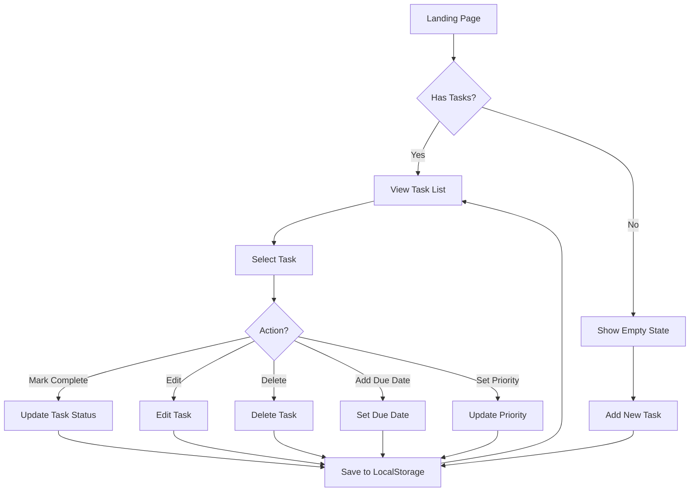
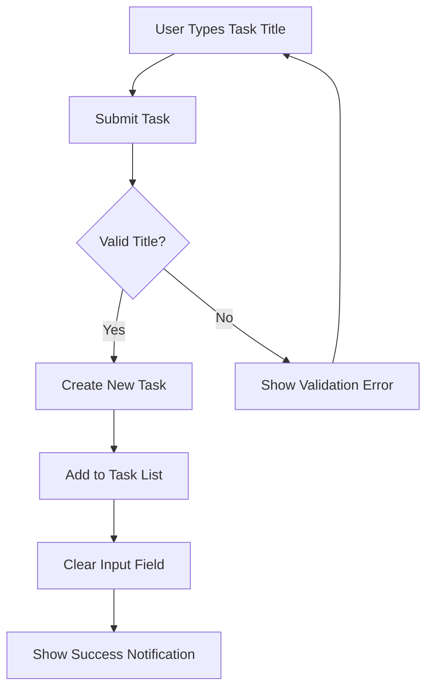
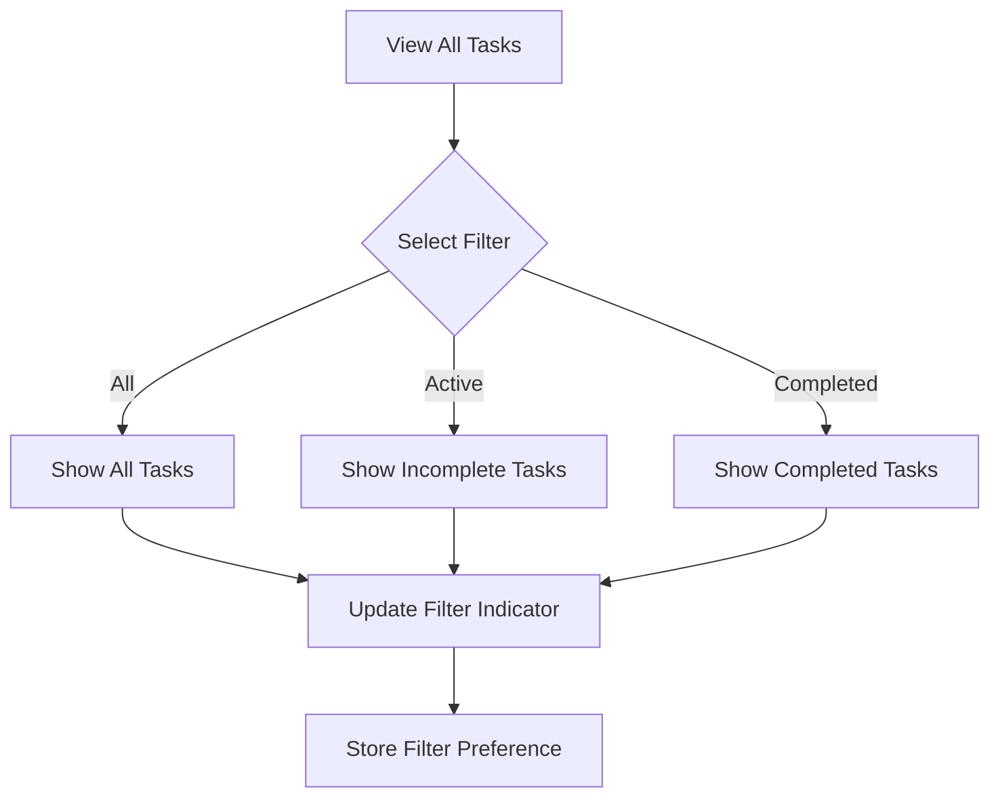
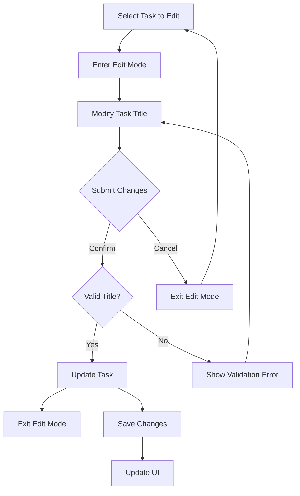
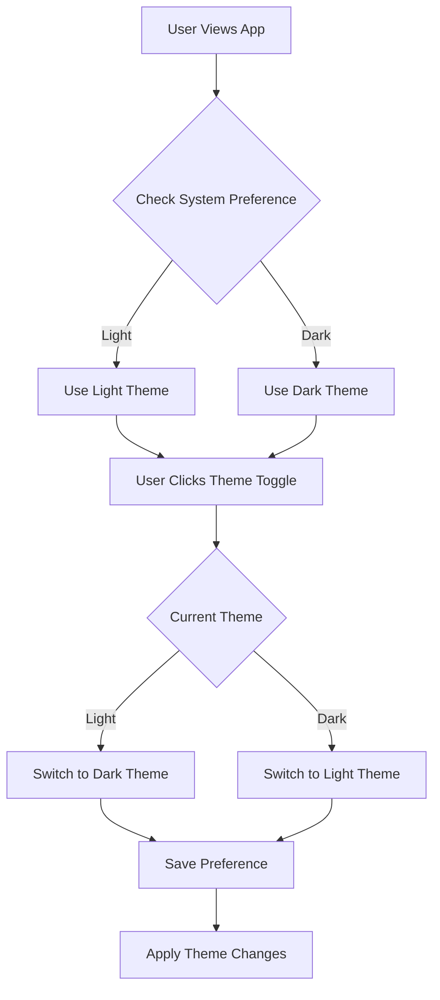
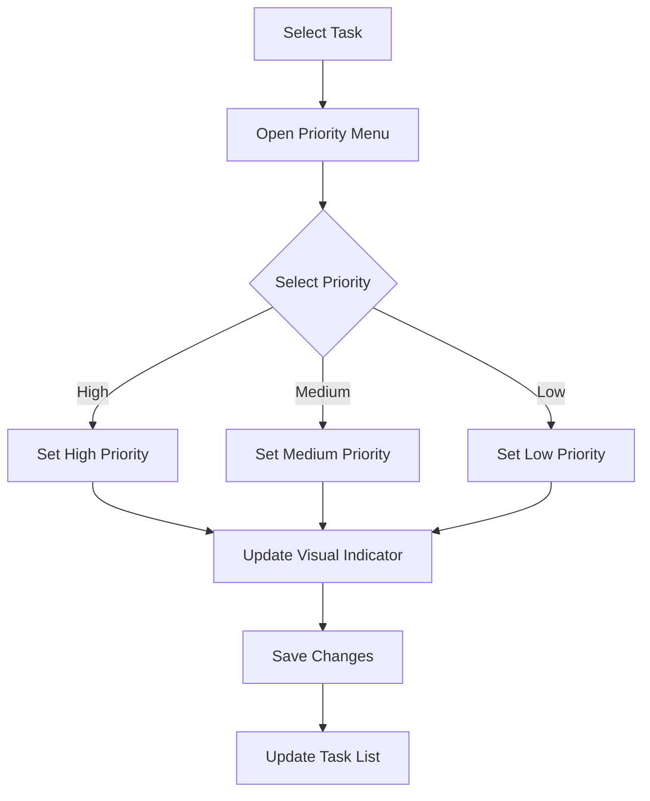
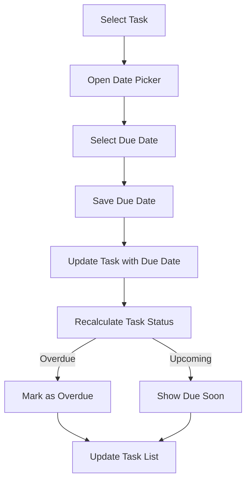

# User Flows - Todo Application

This document describes the primary user flows in the Todo application, represented as diagrams.

## Core User Flows

### 1. Task Management Flow

### 2. Task Creation Flow

### 3. Task Filtering Flow

### 4. Task Editing Flow

### 5. Theme Toggle Flow

## Advanced User Flows

### 6. Priority Management Flow

### 7. Due Date Management Flow

